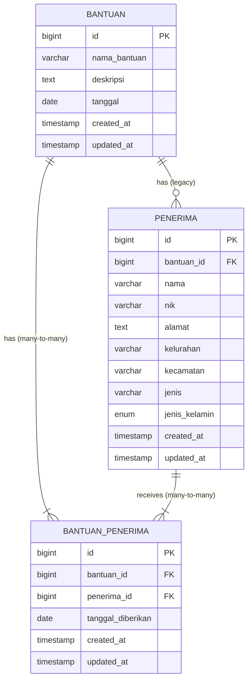

# Database Schema Documentation

## Entity Relationship Diagram



## Table Details

### 1. `bantuan` Table

**Purpose**: Stores information about assistance programs provided by Dinas Sosial.

**Columns**:
| Column Name | Data Type | Constraints | Description |
|-------------|-----------|-------------|-------------|
| id | BIGINT | PRIMARY KEY, AUTO_INCREMENT | Unique identifier for each assistance program |
| nama_bantuan | VARCHAR(255) | NOT NULL | Name of the assistance program |
| deskripsi | TEXT | NOT NULL | Detailed description of the assistance |
| tanggal | DATE | NOT NULL | Date when the assistance is distributed |
| created_at | TIMESTAMP | | Timestamp when record was created |
| updated_at | TIMESTAMP | | Timestamp when record was last updated |

**Indexes**:

-   PRIMARY KEY (id)
-   INDEX (nama_bantuan) for search optimization

### 2. `penerima` Table

**Purpose**: Stores information about recipients who receive assistance.

**Columns**:
| Column Name | Data Type | Constraints | Description |
|-------------|-----------|-------------|-------------|
| id | BIGINT | PRIMARY KEY, AUTO_INCREMENT | Unique identifier for each recipient |
| bantuan_id | BIGINT | FOREIGN KEY, NOT NULL | Reference to the assistance program |
| nama | VARCHAR(255) | NOT NULL | Full name of the recipient |
| nik | VARCHAR(16) | UNIQUE, NOT NULL | Indonesian ID number (16 digits) |
| alamat | TEXT | NOT NULL | Full address of the recipient |
| kelurahan | VARCHAR(255) | NOT NULL | Village/Sub-district |
| kecamatan | VARCHAR(255) | NOT NULL | District |
| jenis | VARCHAR(50) | NOT NULL | Type of recipient (disabilitas, lansia, etc.) |
| jenis_kelamin | ENUM('L','P') | NOT NULL | Gender (L=Laki-laki, P=Perempuan) |
| created_at | TIMESTAMP | | Timestamp when record was created |
| updated_at | TIMESTAMP | | Timestamp when record was last updated |

**Indexes**:

-   PRIMARY KEY (id)
-   FOREIGN KEY (bantuan_id) REFERENCES bantuan(id)
-   UNIQUE INDEX (nik) to prevent duplicate NIK
-   INDEX (nama) for search optimization
-   INDEX (kelurahan, kecamatan) for location-based filtering

## Relationships

### Legacy One-to-Many Relationship (Deprecated but Functional)

-   **Bantuan** to **Penerima**: One assistance program can have many recipients
-   **Penerima** to **Bantuan**: Each recipient belongs to exactly one assistance program

### New Many-to-Many Relationship (Recommended)

-   **Bantuan** to **Penerima**: One assistance program can have many recipients
-   **Penerima** to **Bantuan**: One recipient can receive many assistance programs
-   **Bantuan_Penerima**: Pivot table managing the many-to-many relationship

**Legacy Relationship Implementation**:

```php
// In Bantuan model
public function penerima()
{
    return $this->hasMany(Penerima::class);
}

// In Penerima model
public function bantuan()
{
    return $this->belongsTo(Bantuan::class);
}
```

**New Many-to-Many Relationship Implementation**:

```php
// In Bantuan model
public function penerimas()
{
    return $this->belongsToMany(Penerima::class, 'bantuan_penerima')
                ->withPivot('tanggal_diberikan')
                ->withTimestamps();
}

// In Penerima model
public function bantuans()
{
    return $this->belongsToMany(Bantuan::class, 'bantuan_penerima')
                ->withPivot('tanggal_diberikan')
                ->withTimestamps();
}
```

## Data Constraints and Validation

### NIK (Nomor Induk Kependudukan) Format

-   Must be exactly 16 digits
-   Format: XXXXXXDDMMYYXXXX where:
    -   First 6 digits: Area code (province/regency)
    -   Next 8 digits: Birth date (DDMMYY)
    -   Last 2 digits: Serial number

### Jenis (Type) Values

The `jenis` column accepts these values:

-   disabilitas (Disability)
-   lansia (Elderly)
-   pengemis (Beggar)
-   anak_terlantar (Neglected Child)
-   keluarga_miskin (Poor Family)

### Jenis Kelamin (Gender) Values

-   L (Laki-laki / Male)
-   P (Perempuan / Female)

## Sample Data

### Sample Bantuan Record

```json
{
    "id": 1,
    "nama_bantuan": "Bantuan Sosial Tunai",
    "deskripsi": "Bantuan langsung tunai untuk masyarakat terdampak pandemi",
    "tanggal": "2024-01-15",
    "created_at": "2024-01-10 10:00:00",
    "updated_at": "2024-01-10 10:00:00"
}
```

### Sample Penerima Record

```json
{
    "id": 1,
    "bantuan_id": 1,
    "nama": "Ahmad Wijaya",
    "nik": "3201011234560001",
    "alamat": "Jl. Merdeka No. 123",
    "kelurahan": "Menteng",
    "kecamatan": "Menteng",
    "jenis": "lansia",
    "jenis_kelamin": "L",
    "created_at": "2024-01-11 09:30:00",
    "updated_at": "2024-01-11 09:30:00"
}
```

## Query Examples

### Get All Recipients for a Specific Assistance

```sql
SELECT p.*
FROM penerima p
JOIN bantuan b ON p.bantuan_id = b.id
WHERE b.nama_bantuan = 'Bantuan Sosial Tunai';
```

### Count Recipients by Type

```sql
SELECT jenis, COUNT(*) as total
FROM penerima
GROUP BY jenis;
```

### Get Recipients by Location

```sql
SELECT kecamatan, kelurahan, COUNT(*) as total_penerima
FROM penerima
GROUP BY kecamatan, kelurahan
ORDER BY kecamatan, kelurahan;
```

## Migration Scripts

### Create Bantuan Table

```php
Schema::create('bantuan', function (Blueprint $table) {
    $table->id();
    $table->string('nama_bantuan', 255);
    $table->text('deskripsi');
    $table->date('tanggal');
    $table->timestamps();
    $table->index('nama_bantuan');
});
```

### Create Penerima Table

```php
Schema::create('penerima', function (Blueprint $table) {
    $table->id();
    $table->foreignId('bantuan_id')->constrained('bantuan');
    $table->string('nama', 255);
    $table->string('nik', 16)->unique();
    $table->text('alamat');
    $table->string('kelurahan', 255);
    $table->string('kecamatan', 255);
    $table->string('jenis', 50);
    $table->enum('jenis_kelamin', ['L', 'P']);
    $table->timestamps();

    $table->index('nama');
    $table->index(['kelurahan', 'kecamatan']);
});
```
